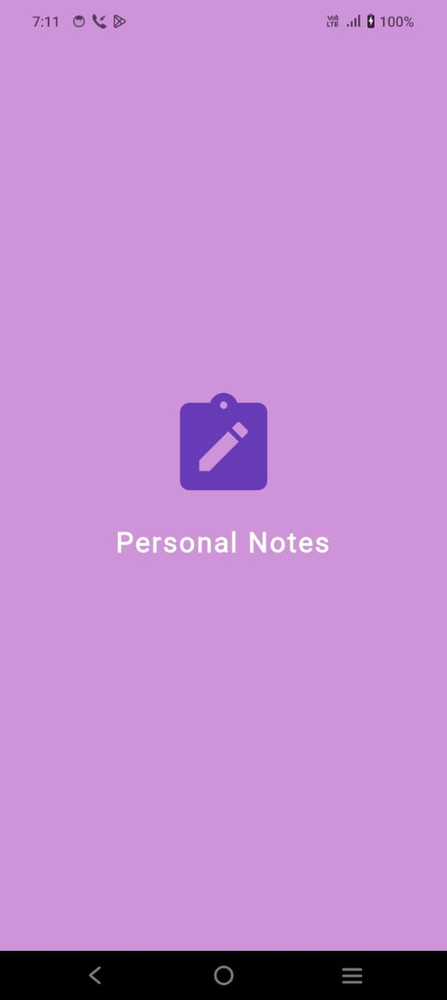
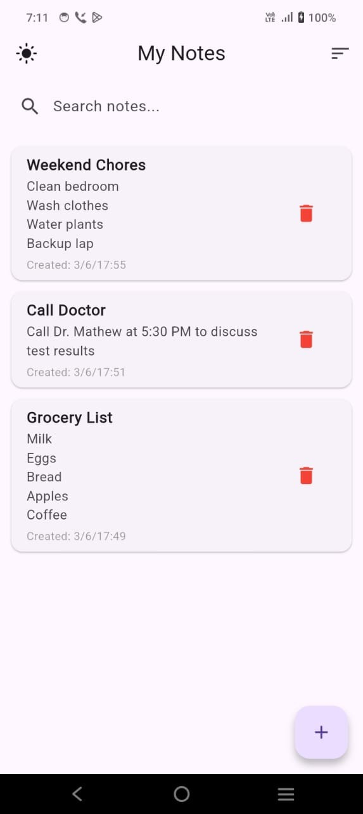
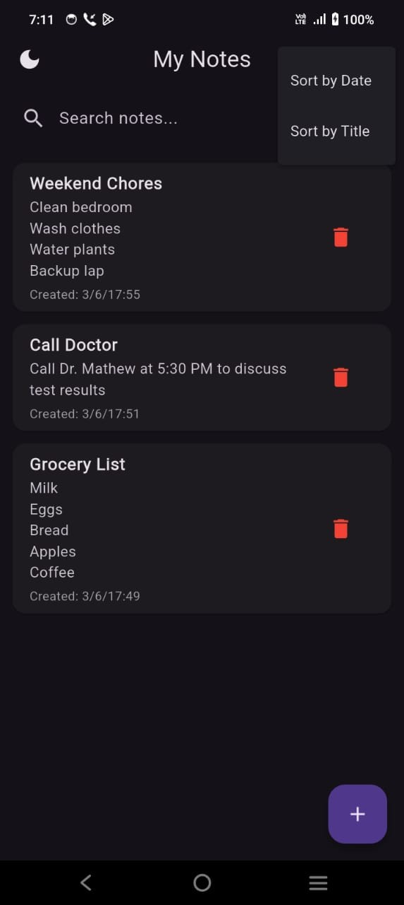
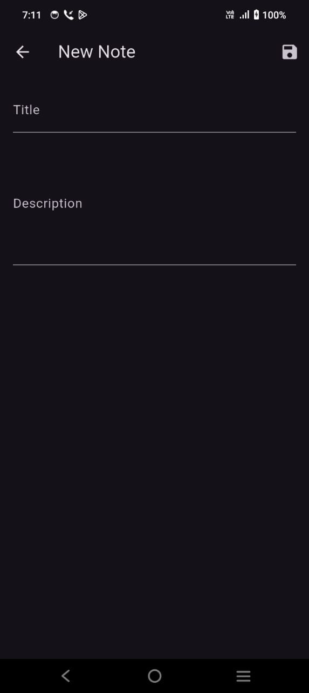

# 📝 Personal Notes App (Flutter + Hive)

A simple and clean **Flutter app** to create, view, edit, and delete personal notes. Built using **Hive** for fast local storage, this app includes dark mode support, search, sorting, and a splash screen with a note icon.

---

## 📱 Features

- ✅ Add, edit, and delete notes
- 🔍 Live search by note title
- ⬆️ Sort notes by creation date or title
- 🌙 Light/Dark theme toggle with icon
- 💾 Local database using Hive
- 🎬 Splash screen with centered note icon

---
📸 Screenshots

### 🚀 Splash Screen

### 🏠 Home Screen (Light Mode)

### 🌙 Home Screen (Dark Mode)

### ✍️ Add Note
